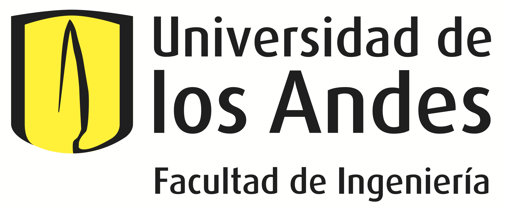
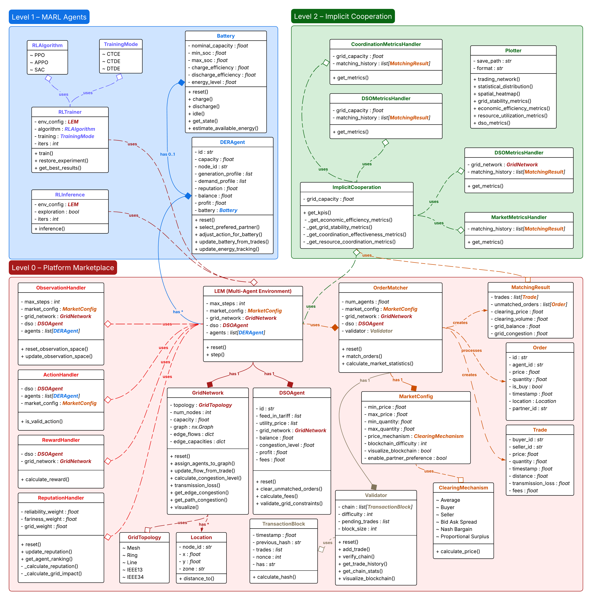
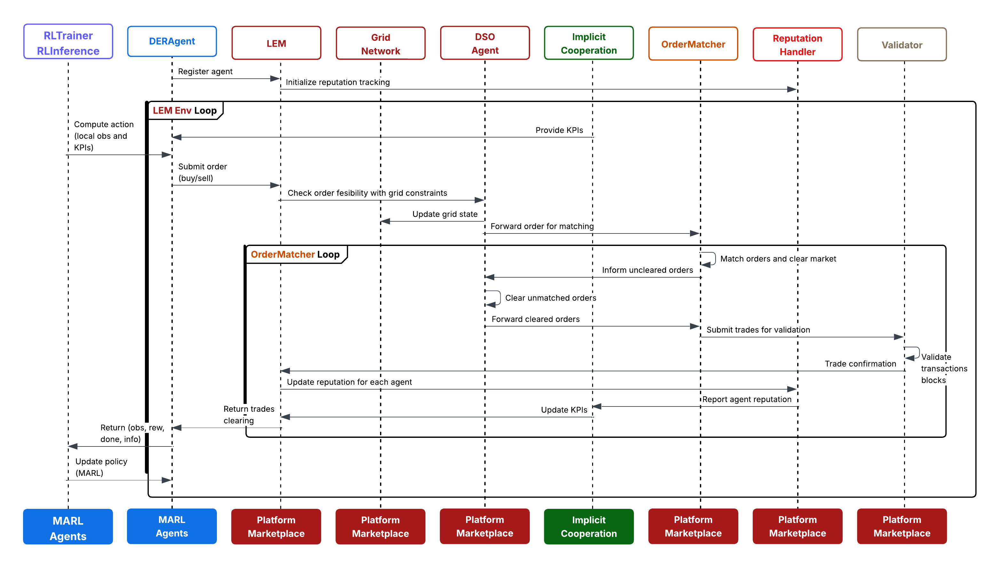

# MARLEM: Multi-Agent Reinforcement Learning Simulation Framework for Implicit Cooperation in Decentralized Local Energy Markets

[](LICENSE)
[](https://www.python.org/downloads/)

This project implements a decentralized multi-agent reinforcement learning (MARL) framework for local energy markets, focusing on implicit cooperation between agents to maintain grid balance while maximizing economic efficiency.

## Table of Contents

- [Introduction](#introduction)
  - [What can the software do?](#what-can-the-software-do)
  - [Research Context](#research-context)
- [Main Features](#main-features)
- [Project Structure](#project-structure)
- [Installation](#installation)
  - [Prerequisites](#prerequisites)
  - [Environment Setup](#environment-setup)
  - [Uninstall](#uninstall)
- [Quick Start](#quick-start)
- [Case Studies](#case-studies)
- [Code Structure and Design](#code-structure-and-design)
- [Analysis Tools](#analysis-tools)
- [Documentation](#documentation)
- [Contributing](#contributing)
- [License](#license)

## Introduction

### What can the software do?

This framework enables researchers and practitioners to:

- **Simulate decentralized local energy markets** with multiple agents trading energy through peer-to-peer mechanisms
- **Train MARL agents** using various algorithms (PPO, SAC, APPO) in different training paradigms (CTCE, CTDE, DTDE)
- **Evaluate market mechanisms** through comprehensive case studies covering market design, agent heterogeneity, grid constraints, and coordination strategies
- **Analyze coordination effectiveness** through implicit cooperation models that enable agents to coordinate without explicit communication
- **Visualize market outcomes** with comprehensive analytics and visualization tools

The framework is designed to support research on decentralized energy markets, helping answer questions about market design, agent behavior, grid stability, and the effectiveness of implicit coordination mechanisms.

### Research Context

This PhD research project focuses on developing an implicit cooperation model for coordinating decentralized agents and their distributed energy resources (DERs) in day-ahead and intraday local energy markets (LEMs). The goal is to achieve optimal balance between energy supply and demand through a decentralized approach, where agents make decisions based on limited local information without centralized control.

**Main Research Question**: How does implicit cooperation, enabled by MARL, improve the management of DERs to maximize their energy use while ensuring the balance between supply and demand in LEMs?

## Main Features

- **Decentralized Market Clearing**: Agent-to-agent matching with multiple pricing mechanisms (average, buyer, seller, Nash bargaining, proportional surplus)
- **Multi-Agent Reinforcement Learning**: Support for CTCE, CTDE, and DTDE training paradigms with multiple RL algorithms
- **Implicit Cooperation Model**: Privacy-preserving coordination mechanisms that enable agents to coordinate without explicit communication
- **Comprehensive Case Studies**: Six case studies covering market mechanisms, agent heterogeneity, DSO intervention, grid constraints, battery coordination, and implicit cooperation effectiveness
- **Grid Integration**: Physical grid modeling with topology constraints, congestion management, and DSO fallback mechanisms
- **Scenario Testing**: Framework for evaluating system behavior under various market conditions
- **Ablation Studies**: Tools for analyzing component contributions to system performance
- **Visualization Tools**: Comprehensive plotting and analytics for market outcomes and agent behaviors

## Project Structure

### Directory Structure

```
.
├── src/                    # Source code
│   ├── agent/              # Agent implementations and policies
│   ├── analytics/          # Metrics and performance analysis
│   ├── coordination/       # Implicit cooperation mechanisms
│   ├── environment/        # Market environment and training
│   ├── grid/               # Grid network modeling
│   ├── market/             # Market mechanisms and clearing
│   ├── profile/            # Energy profile generation
│   └── visualization/      # Plotting and visualization tools
├── cases/                  # Case studies and scenarios
├── data/                   # Input data (demand, generation, prices)
├── docs/                   # Documentation
├── tests/                  # Unit and integration tests
└── notebooks/              # Jupyter notebooks for exploration
```

### Architecture of the framework

The project is organized into three conceptual layers:

- **Level 0: Platform Marketplace** - Base infrastructure for the decentralized energy market
- **Level 1: MARL Agents** - Decentralized partially observable Markov decision process (Dec-POMDP) implementation
- **Level 2: Implicit Cooperation Model** - Coordination mechanisms between agents



### Simulation Workflow

The `step` method within the LEM environment manages a sequence of eight distinct phases, from initial agent decision to the final observation and reward feedback (see Fig. \ref{fig:sequence-diagram}).

A detailed breakdown of the simulation process is as follows:

1. **Action processing and validation:** The workflow begins with the raw action received from the MARL policies. Agents limit each action based on the current generation, demand, and the agent's battery state. Subsequently, the _Action Module_ performs a rule-based validation, ensuring the action's components fall within the predefined market bounds.

2. **Order creation and market submission:** Validated actions are then formatted into formal orders. This phase culminates in a collection of structured orders ready for market submission.

3. **Market clearing and trade execution:** The collection of orders is passed to the _Market Module_ which executes its three-stage clearing process. The output of this phase is a list of all executed trades and summary statistics.

4. **Energy tracking and battery updates:** The list of all executed trades is used to update the physical state of each agent, and grid state.

5. **Reward calculation and KPI updates:** The _Implicit Cooperation Module_ gathers all necessary data to compute the full suite of system-level KPIs. These KPIs are then passed to the reward function, which calculates the final, composite reward for each agent.

6. **State transitions and environment updates:** This phase advances the simulation's global state, and the environment's internal clock is incremented. Crucially, agent-level states that depend on the full market outcome are updated based on the results from the _Reputation Module_.

7. **Observation update and information sharing:** The _Observation Module_ constructs the next local observation for each agent. This step closes the information loop, providing agents with the feedback necessary for their next decision.

8. **Episode management and termination:** Finally, the environment checks for termination conditions. If the episode has not concluded, the environment returns the newly generated observations and computed rewards to the MARL algorithm, and the entire workflow repeats for the next trading period.



## Installation

### Prerequisites

- Python >= 3.12+
- [Miniforge](https://github.com/conda-forge/miniforge) (recommended)
- Git (for cloning the repository)

### Environment Setup

It is recommended to install [Miniforge](https://github.com/conda-forge/miniforge) as an environment to install Python and the necessary libraries. Miniforge is a distribution of Python and the `conda` package manager, which easily allows for environment configuration and package installation from the `conda-forge` repository.

During installation, use the recommended options in the `Advanced Installation Options`.

#### Step 1: Clone the Repository

```bash
git clone https://github.com/salazarna/marlem
cd marlem
```

#### Step 2: Create the Environment

From the `(base)` environment, navigate to the project directory and create the environment:

```bash
conda env create --file environment.yml
```

This creates a new environment named `marlem` with all necessary dependencies.

#### Step 3: Activate the Environment

```bash
conda activate marlem
```

You should now see `(marlem)` in your terminal prompt.

#### Step 4: Install Jupyter Kernel (Optional)

To use the environment with Jupyter notebooks:

```bash
python -m ipykernel install --user --name phd --display-name "marlem"
```

#### Step 5: Verify Installation

You can verify the installation by running:

```bash
python -c "import src; print('Installation successful!')"
```

### Uninstall

To remove the Jupyter kernel:

```bash
jupyter kernelspec remove marlem
```

To remove the conda environment:

```bash
conda deactivate
conda env remove -n marlem
```

## Quick Start

### Running a Simple Case Study

The simplest way to get started is to run one of the demo case studies:

```bash
python cases/run_demo_case_studies.py
```

This will execute demonstrative case studies and save results in the `downloads/` directory.

### Running All Case Studies

To run all comprehensive case studies:

```bash
python cases/run_case_studies.py
```

### Running Specific Case Studies

You can also run individual case studies programmatically:

```python
from cases import get_case_study

# Get scenarios from Case 1 (Market Mechanisms)
case1_scenarios = get_case_study("case1_market_mechanisms")

# Iterate through scenarios
for scenario_name, config in case1_scenarios.items():
    print(f"Scenario: {scenario_name}")
    print(f"Agents: {len(config.agents)}")
    print(f"Market mechanism: {config.market.price_mechanism}")
```

### Training MARL Agents

To train agents using reinforcement learning:

```python
from src.environment.train import RLTrainer, TrainingMode, RLAlgorithm
from cases import get_case_study

# Get a scenario
scenarios = get_case_study("case1_market_mechanisms")
scenario_name, config = next(iter(scenarios.items()))

# Train with CTDE (Centralized Training, Decentralized Execution)
trainer = RLTrainer(
    env_config=config,
    algorithm=RLAlgorithm.PPO,
    training=TrainingMode.CTDE,
    iters=100
)
trainer.train()
```

## Case Studies

The project includes six comprehensive case studies designed to systematically answer the research questions:

### Case 1: Market Mechanism Comparison ([🔗](./notebooks/case1_market_mechanisms.ipynb))

**Objective**: Compare different clearing mechanisms to identify optimal pricing approaches.

- **Scenarios**: 6 scenarios testing different clearing mechanisms
- **Key Variables**: Market clearing mechanism (AVERAGE, BUYER, SELLER, NASH_BARGAINING, etc.)

### Case 2: Agent Heterogeneity & Market Power ([🔗](./notebooks/case2_agent_heterogeneity.ipynb))

**Objective**: Analyze how agent size differences and market concentration affect coordination.

- **Scenarios**: 4 market structures (balanced, monopoly, oligopoly, cooperative)
- **Key Variables**: Agent capacity distribution, market concentration

### Case 3: DSO Intervention Strategies ([🔗](./notebooks/case3_dso_intervention.ipynb))

**Objective**: Study how different DSO regulatory approaches affect market participation.

- **Scenarios**: 4 regulatory approaches (permissive, moderate, strict, dynamic)
- **Key Variables**: DSO intervention thresholds, penalty structures

### Case 4: Grid Topology & Congestion Effects ([🔗](./notebooks/case4_grid_constraints.ipynb))

**Objective**: Examine how grid physical constraints affect market outcomes.

- **Scenarios**: 12 combinations of 4 topologies × 3 capacity levels
- **Key Variables**: Grid topology (STAR, MESH, RING, TREE), capacity constraints

### Case 5: Battery Storage Coordination ([🔗](./notebooks/case5_battery_coordination.ipynb))

**Objective**: Analyze how different storage configurations enhance coordination.

- **Scenarios**: 6 storage deployment strategies
- **Key Variables**: Battery deployment, capacity ratios, efficiency levels

### Case 6: Implicit Cooperation Effectiveness ([🔗](./notebooks/case6_implicit_cooperation.ipynb))

**Objective**: Directly test how **implicit** cooperation improves DER management.

- **Scenarios**: 6 scenarios testing coordination effectiveness
- **Key Variables**: Coordination level (none, implicit, explicit), cooperation conditions

For detailed information about each case study, see [`cases/README.md`](cases/README.md).

## Testing Framework

Comprehensive testing ensures code quality:

- **Unit Tests**: Test individual components in isolation (`tests/test_*.py`)
- **Integration Tests**: Verify interactions between components
- **Scenario Tests**: Evaluate system behavior under different conditions
- **Consistency Tests**: Ensure consistent behavior across different implementations

Run tests with:

```bash
python -m pytest tests/
```

## Analysis Tools

The project includes comprehensive tools for analyzing the behavior and performance of the system:

### Analytics and Metrics

The framework provides several analytics modules for performance evaluation:

- **Coordination Metrics** (`src/analytics/coordination_metrics.py`): Measures coordination effectiveness between agents
- **DSO Metrics** (`src/analytics/dso_metrics.py`): Tracks DSO intervention and grid stability metrics
- **Grid Metrics** (`src/analytics/grid_metrics.py`): Evaluates grid performance and constraint violations
- **Market Analytics** (`src/analytics/market_analytics.py`): Analyzes market outcomes, prices, and trading volumes

### Visualization

The framework includes visualization tools in `src/visualization/` for:

- Market price and volume trends
- Agent behavior and strategy visualization
- Grid state visualization
- Performance comparison across scenarios

## Contributing

Contributions to this project are welcome! When contributing:

1. Follow the coding guidelines in [`docs/guidelines.md`](docs/guidelines.md)
2. Ensure all tests pass: `python -m pytest tests/`
3. Maintain code coverage and documentation
4. Follow the project structure and design patterns

For major changes or new features, please open an issue first to discuss the proposed changes.

## Citation

The original paper describing the methods implemented is:

```
Salazar-Peña, N., Tabares, A., Gonzalez-Mancera, A., 2025. MARLEM: Multi-Agent Reinforcement Learning Simulation Framework for Implicit Cooperation in Decentralized Local Energy Markets. Journal, Vol. XXX, XXXXXX. URL: <>, doi: <>.
```

The BibTex entry:

```
@article{SalazarPena2025,
title = "MARLEM: Multi-Agent Reinforcement Learning Simulation Framework for Implicit Cooperation in Decentralized Local Energy Markets",
journal = "",
volume = "",
pages = "",
year = "",
issn = "",
doi = "",
url = "",
author = "Nelson Salazar-Peña and Alejandra Tabares and Andrés González-Mancera",
keywords = "Local Energy Markets, Multi-Agent Reinforcement Learning, Decentralized Partially Observable Markov Decision Process, Implicit Cooperation, Decentralized Energy Systems, Simulation Framework",
}
```

## License

This project is licensed under the **GNU Affero General Public License v3.0** (AGPL-3.0), as specified in the [`LICENSE`](LICENSE) file.

This is a copyleft license that requires that any derivative work be licensed under the same terms as the original work.
